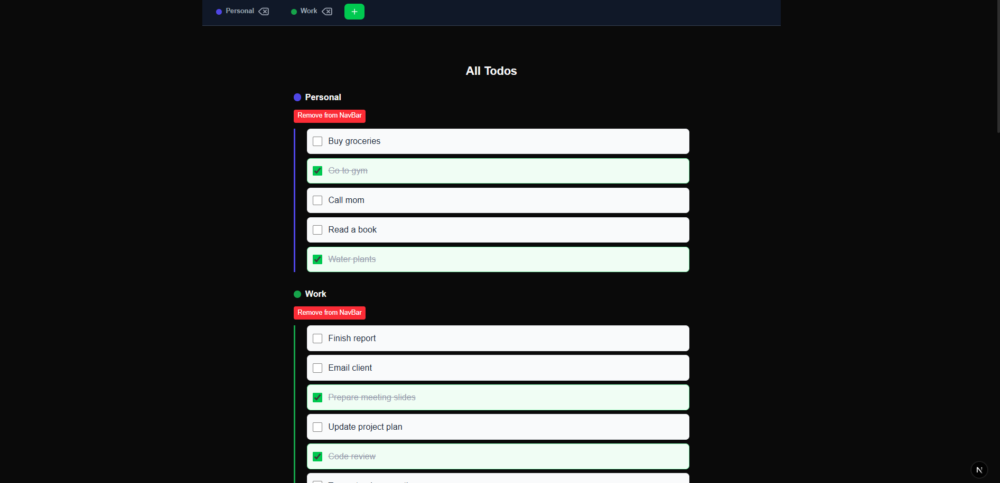

# 📝 Next.js + Zustand Todo App

A modern, responsive, and fully animated Todo application built with **Next.js**, **Zustand**, and **Framer Motion**.  
The project features **full state management**, server-client component integration, and a mock backend powered by **JSON Server**.

---

## 🚀 Features
- **Full State Management** using [Zustand](https://github.com/pmndrs/zustand)
- **Server & Client Components** (Next.js App Router)
- **JSON Server** for a local REST API backend
- **Framer Motion** animations for smooth UI transitions
- Responsive design for **mobile & desktop**
- Swipe-to-delete (mobile) and context menu (desktop)
- Dynamic tabs with filtering and color customization

---

## 🛠 Tech Stack
- **Frontend:** [Next.js](https://nextjs.org/) + React
- **State Management:** [Zustand](https://github.com/pmndrs/zustand)
- **Animations:** [Framer Motion](https://www.framer.com/motion/)
- **Backend (Mock):** [JSON Server](https://github.com/typicode/json-server)
- **Styling:** Tailwind CSS

---

## 📦 Installation & Setup
```bash
# Clone the repository
git clone https://github.com/Hanafi6/nextjs-zustand-todo-app.git

# Navigate into the project
cd nextjs-zustand-todo-app

# Install dependencies
npm install

# Run the development server
npm run dev
